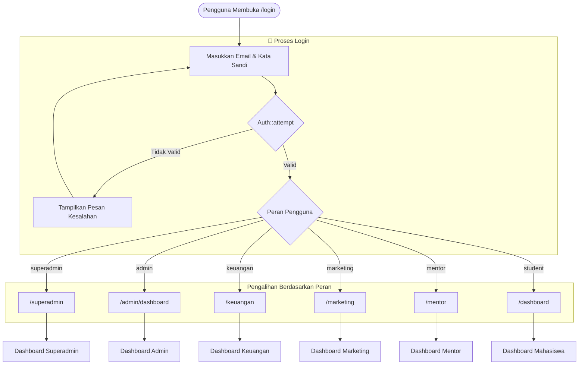
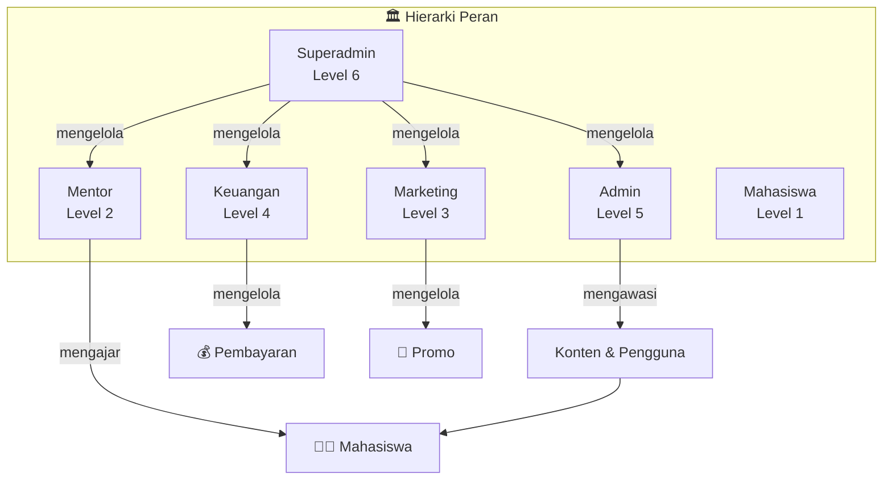
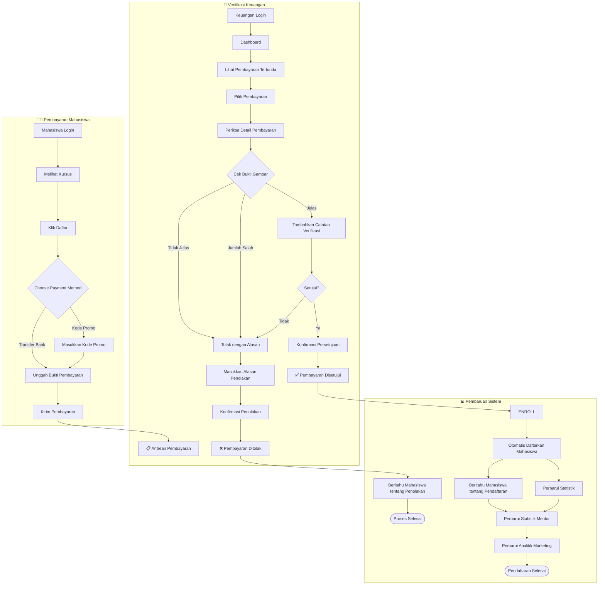
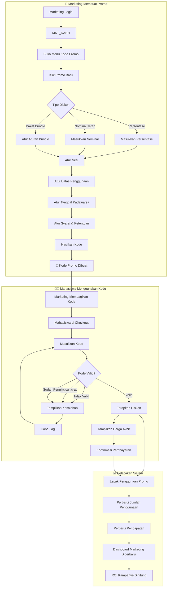
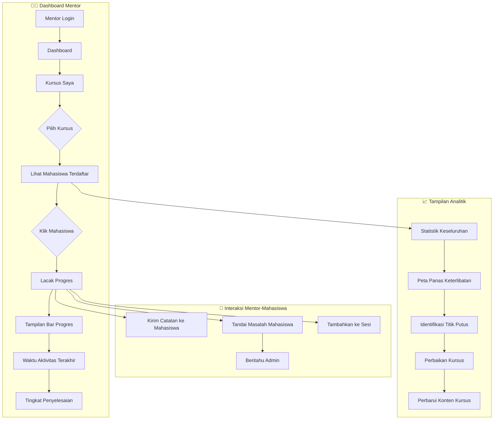
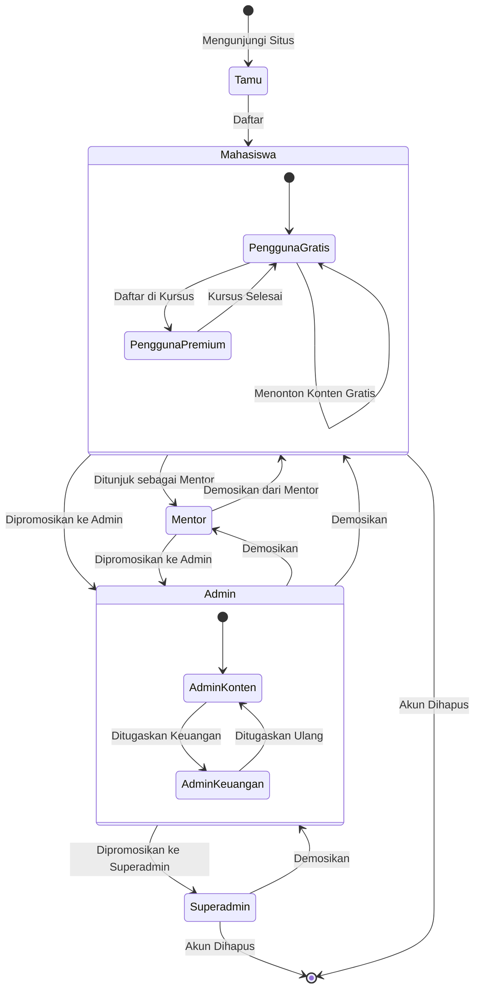
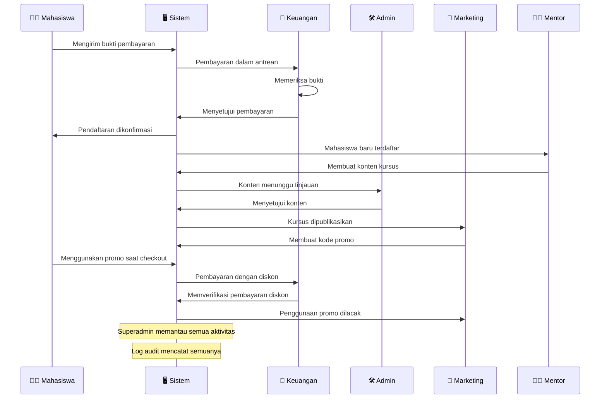

# 1Langkah - Diagram Alur Sistem Berbasis Peran

## 1. Alur Autentikasi & Pengalihan



---

## 2. Hierarki Peran & Kontrol Akses



---

## 3. Alur Verifikasi Pembayaran (Alur Utama Keuangan)



---

## 4. Alur Pembuatan & Penugasan Kursus

```mermaid
flowchart TD
    subgraph ADMIN_CREATE["🛠️ Admin Membuat Kursus"]
        ADM_LOGIN[Admin Login] --> ADM_COURSE[Buka Menu Kursus]
        ADM_COURSE --> CREATE_COURSE[Klik Kursus Baru]
        CREATE_COURSE --> FILL_DETAILS[Isi Detail Kursus]
        FILL_DETAILS --> SELECT_LEVEL[Pilih Level]
        SELECT_LEVEL --> CHOOSE_MENTOR
        
        CHOOSE_MENTOR{Pilih Mentor}
        CHOOSE_MENTOR -->|Mentor Ada| SELECT_EX[Pilih dari Daftar]
        CHOOSE_MENTOR -->|Mentor Baru| CREATE_MEN[Buat Profil Mentor]
        CREATE_MEN --> LINK_MEN[Tautkan Mentor ke Kursus]
        SELECT_EX --> LINK_MEN
        LINK_MEN --> PUBLISH[Terbitkan Kursus]
    end
    
    subgraph MENTOR_SETUP["👨‍🏫 Mentor Mempersiapkan"]
        PUBLISH --> MEN_NOTIFY[Mentor Menerima Notifikasi]
        MEN_NOTIFY --> MEN_LOGIN[Mentor Login]
        MEN_LOGIN --> MEN_COURSE[Lihat Kursus yang Ditugaskan]
        MEN_COURSE --> ADD_CHAPTERS[Tambahkan Bab & Video]
        ADD_CHAPTERS --> ADD_QUIZ[Tambahkan Soal Kuis]
        ADD_QUIZ --> SET_PRICE[Atur Harga]
        SET_PRICE --> COURSE_LIVE[Kursus Tayang]
    end
    
    subgraph STUDENT_ENROLL["👨‍🎓 Mahasiswa Menemukan"]
        COURSE_LIVE --> COURSE_LIST[Kursus di Katalog]
        COURSE_LIST --> STU_BROWSE[Mahasiswa Menjelajah]
        STU_BROWSE --> STU_DETAIL[Lihat Detail Kursus]
        STU_DETAIL --> STU_ENROLL{Klik Daftar}
        STU_ENROLL --> PAYMENT_FLOW
    end
    
    PAYMENT_FLOW --> PAYMENT["💳 Alur Pembayaran"]
    
    subgraph FEEDBACK_LOOP["🔄 Umpan Balik"]
        PAYMENT --> STUDENT_ENROLLED[Mahasiswa Terdaftar]
        STUDENT_ENROLLED --> COMPLETES[Menyelesaikan Kursus]
        COMPLETES --> LEAVES_RATING[Memberi Rating]
        LEAVES_RATING --> RATING_UPDATE[Rating Diperbarui]
        RATING_UPDATE --> MKT_ANALYTICS[Marketing Melihat Performa]
        MKT_ANALYTICS --> ADM_REVIEW[Admin Meninjau Statistik Mentor]
    end
```



---

## 5. Alur Kode Promo (Alur Utama Marketing)



---

## 6. Alur Pelacakan Mahasiswa oleh Mentor



---

## 7. Alur Audit Superadmin

```mermaid
flowchart TD
    subgraph LOG_ACTIONS["📝 Sistem Mencatat Aktivitas Ini"]
        CREATE[Operasi Buat]
        UPDATE[Operasi Ubah]
        DELETE[Operasi Hapus]
        LOGIN[Login/Logout]
        PAYMENT[Verifikasi/Tolak Pembayaran]
        ROLE_CHANGE[Perubahan Peran]
    end
    
    subgraph AUDIT_VIEW["🔍 Log Audit Superadmin"]
        SA_LOGIN[Superadmin Login] --> SA_DASH
        SA_DASH --> AUDIT_LINK[Klik Log Audit]
        AUDIT_LINK --> FILTER_DATE[Filter berdasarkan Tanggal]
        FILTER_DATE --> FILTER_ROLE[Filter berdasarkan Peran]
        FILTER_ROLE --> FILTER_ACTION{Filter berdasarkan Aksi}
        FILTER_ACTION -->|Semua| ALL_ACTIONS
        FILTER_ACTION -->|Buat| CREATES_ONLY
        FILTER_ACTION -->|Ubah| UPDATES_ONLY
        FILTER_ACTION -->|Hapus| DELETES_ONLY
        FILTER_ACTION -->|Pembayaran| PAYMENTS_ONLY
        
        ALL_ACTIONS --> VIEW_LOG[Lihat Log Lengkap]
        CREATES_ONLY --> VIEW_LOG
        UPDATES_ONLY --> VIEW_LOG
        DELETES_ONLY --> VIEW_LOG
        PAYMENTS_ONLY --> VIEW_LOG
        
        VIEW_LOG --> DETAIL{Lihat Detail?}
        DETAIL -->|Ya| SHOW_CHANGES[Tampilkan Nilai Lama vs Baru]
        DETAIL -->|Tidak| EXPORT
        SHOW_CHANGES --> EXPORT
        EXPORT[Export ke CSV/PDF]
    end
    
    subgraph ALERTS["🚨 Peringatan Otomatis"]
        LOG_ACTIONS --> CHECK_SUSPICIOUS
        CHECK_SUSPICIOUS{Aktivitas Mencurigakan?}
        CHECK_SUSPICIOUS -->|Ya| SEND_ALERT[Email ke Superadmin]
        CHECK_SUSPICIOUS -->|Tidak| STORE_LOG
        SEND_ALERT --> STORE_LOG
        STORE_LOG[(Database: audit_logs)]
    end
```



---

## 8. Peta Interkoneksi Peran Lengkap

```mermaid
flowchart TB
    subgraph STUDENT_NODE["👨‍🎓 MAHASISWA"]
        S1[Menjelajah Kursus]
        S2[Daftar dengan Pembayaran]
        S3[Belajar & Menonton Video]
        S4[Menyelesaikan Kuis]
        S5[Memberi Rating & Ulasan]
        S6[Membuat Portfolio]
    end
    
    subgraph MENTOR_NODE["👨‍🏫 MENTOR"]
        M1[Membuat Konten Kursus]
        M2[Melacak Progres Mahasiswa]
        M3[Mengadakan Sesi]
        M4[Menjawab Pertanyaan]
        M5[Melihat Rating & Ulasan]
    end
    
    subgraph ADMIN_NODE["🛠️ ADMIN"]
        A1[Mengelola Semua Konten]
        A2[Menetapkan Mentor]
        A3[Menangani Masalah Pengguna]
        A4[Meninjau Laporan]
    end
    
    subgraph KEUANGAN_NODE["💼 KEUANGAN"]
        K1[Memverifikasi Pembayaran]
        K2[Melacak Pendapatan]
        K3[Menangani Pengembalian Dana]
        K4[Membuat Laporan Keuangan]
    end
    
    subgraph MARKETING_NODE["📢 MARKETING"]
        MK1[Membuat Kode Promo]
        MK2[Melacak Kampanye]
        MK3[Menganalisis Tren]
        MK4[Mengelola Promo Acara]
    end
    
    subgraph SUPERADMIN_NODE["👑 SUPERADMIN"]
        SU1[Mengelola Semua Pengguna]
        SU2[Melihat Log Audit]
        SU3[Konfigurasi Sistem]
        SU4[Menangani Eskalasi]
    end
    
    %% Student connections
    S2 -->|"Pembayaran diajukan"| K1
    S3 -->|"Progres dilacak"| M2
    S4 -->|"Kuis selesai"| M2
    S5 -->|"Rating diajukan"| MK3
    
    %% Mentor connections
    M1 -->|"Kursus dibuat"| A1
    M2 -->|"Laporan progres"| A4
    M5 -->|"Ulasan diterima"| MK3
    
    %% Admin connections
    A1 -->|"Mentor ditugaskan"| M1
    A2 -->|"Pengguna dikelola"| SU1
    A3 -->|"Dieskalasi ke"| SU4
    
    %% Keuangan connections
    K1 -->|"Diverifikasi"| S2
    K2 -->|"Data pendapatan"| MK3
    K4 -->|"Laporan dibuat"| SU4
    
    %% Marketing connections
    MK1 -->|"Promo dibuat"| S2
    MK3 -->|"Analitik dibagikan"| A4
    MK4 -->|"Acara dipromosikan"| A1
    
    %% Superadmin connections
    SU1 -->|"Peran pengguna diatur"| A1
    SU2 -->|"Entri log"| ALL[Semua Departemen]
    SU4 -->|"Resolusi"| ALL
    
    style SUPERADMIN_NODE fill:#7c3aed,color:#fff
    style ADMIN_NODE fill:#ef4444,color:#fff
    style KEUANGAN_NODE fill:#f59e0b,color:#fff
    style MARKETING_NODE fill:#ec4899,color:#fff
    style MENTOR_NODE fill:#3b82f6,color:#fff
    style STUDENT_NODE fill:#10b981,color:#fff
```



---

## 9. State Machine Pengguna



---

## 10. Alur Data Antar Peran



---

## Ringkasan: Referensi Cepat

### Alur Verifikasi Pembayaran
```
Mahasiswa kirim bukti → Keuangan tinjau → Setujui/Tolak → Mahasiswa diberitahu → Terdaftar/Coba Lagi
```

### Alur Pembuatan Kursus
```
Admin buat kursus → Tetapkan mentor → Mentor tambah konten → Dipublikasikan → Mahasiswa daftar
```

### Alur Kode Promo
```
Marketing buat kode → Bagikan ke mahasiswa → Mahasiswa gunakan saat checkout → Pendapatan dilacak
```

### Ringkasan Interkoneksi
| Aksi Oleh | Mempengaruhi | Hasil |
|-----------|--------------|-------|
| Mahasiswa mendaftar | Keuangan, Mentor | Antrean pembayaran, mahasiswa baru |
| Keuangan menyetujui | Mahasiswa, Marketing | Pendaftaran, analitik |
| Marketing buat promo | Mahasiswa, Keuangan | Diskon, pendapatan |
| Mentor update kursus | Admin, Mahasiswa | Konten diperbaiki |
| Admin tetapkan mentor | Mentor | Tanggung jawab baru |
| Superadmin tinjau log | Semua | Kesehatan sistem |
